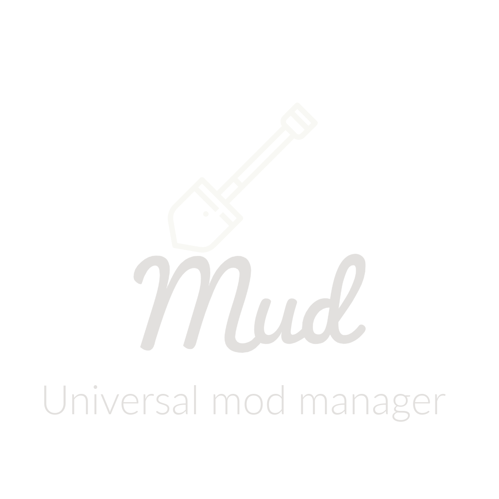

# Mud Lang Support

Rich language support for **Mud**, providing:

- Syntax Highlighting
- IntelliSense
- Signature Help
- Hover Information
- Code Actions

## Installation

1. Open the Extensions view (`Ctrl+Shift+X`).
2. Search for `Mud Lang Support`.
3. Click **Install**.

